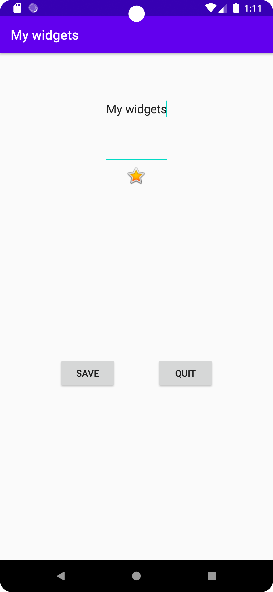

# Rapport

Skapade en contraint layout. Använder match_parent some layout för width och height med följande kod.
```
        android:layout_width="match_parent"
        android:layout_height="match_parent"
```

Lade in en imageview. Constrainade den till parent och använder wrap_content som width och height.

Lade in två knappar. Ändrade texten på knapparna till Save och Quit med följande kod.
```
        android:text="Quit"
        android:text="Save"
```
Constrainade knapparna till ImageView och parent. Använder wrap_content som width och height.

Lade till en text som rubrik där det står My widgets. För denna används wrap content som height 
men 0dp som width, pågrund av att Android Studio klagade när jag försökte ha wrap content som width.
```
        android:layout_width="wrap_content"
        android:layout_height="0dp"
```

Denna text constrainas till toppen av ImageView och till parent.



